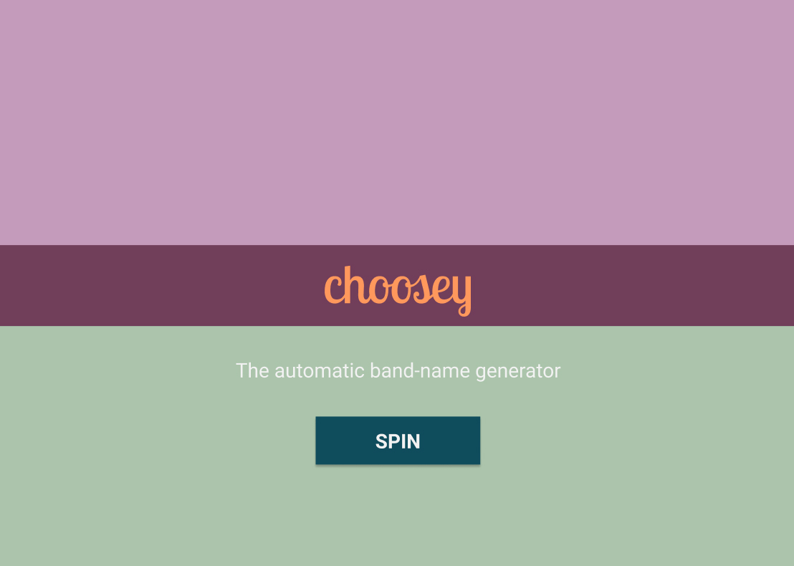

# This is CHOOSY!
A band name generator, for inspiration and incredulation!

## Features

1.  Suggests random string of words of varying length at button click
2.  Option expansion:
    1. Short / medium / long length of name
    2. Genre of music (i.e. country, metal, blues, emo, R'n'B)
    3. Mood (i.e. melancholy, anger, frustration, silly, irreverent)
3.  Save feature to log favourite results (initially, just front-end save to state, so favourites would disappear on refresh)
4.  Future expansion:
    1. Album name generator
    2. Song name generator
    3. Get in touch/share with social media method to alert of names in use

## Functionality

*   Integrate word-generating API to pluck resources on theme (genre/mood)
    *   _Uses Datamuse word-finding query engine_ https://www.datamuse.com/api/
*   Propositions to be chained (definite and indefinite articles - 'the', 'a', 'an' etc.)
*   Specialised JS data file with additional results/suggestions?
*   Current result (& previous results?) saved to state

## Theme / design

*   Light-hearted, friendly, animation and/or illustration

### In progress:

*   Refine API use & method to creatively exploit different search params
*   Define methodology to chain/manipulate word results to give names > 1 word

### To do:

*   Connect TEST_WORDS array to work in tandem with API (eventually replacing test words with dictionary results)
*   Animate border frame to focus attention on result (i.e. flashing lights / name up in lights)
*   Add buttons / controls to further tweak results; i.e. set word length / swap word order (shuffle display array positions)

### Done:

*   Colour palette & typography selection
*   Mock-up Figma sketch of layout
*   Landing page skeleton & button

### `yarn start`

Runs the app in the development mode.\
Open [http://localhost:3000](http://localhost:3000) to view it in the browser.
